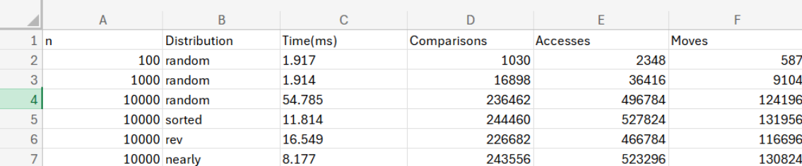

DAA Assignment 2 – Heap Sort
👨‍🎓 Student Information

Student B: Muslim
Partner (Student A): Dinmukhamed
Course: Algorithms and Data Structures
Pair Number: 2
Algorithm Implemented: Heap Sort

📘 Project Overview

This repository contains the implementation and analysis of the Heap Sort algorithm developed for Assignment 2 in the course Algorithms and Data Structures at Astana IT University.

The main goals of this project were to:

Implement Heap Sort in Java.

Analyze its theoretical and empirical performance.

Compare it with the partner’s Shell Sort algorithm.

Heap Sort was implemented using three core Java classes:

HeapSort.java → implements the sorting algorithm and heapify operations.

PerformanceTracker.java → records comparisons, array accesses, and data movements.

BenchmarkRunner.java → runs benchmarks and collects performance data.

🗂️ Repository Structure

src/ – Java source code (algorithms, metrics, cli).
docs/ – reports and performance plots:

heap-sort-report.pdf

analysis-report.pdf

comparison-summary.pdf

performance-plots (graphs and results table)
pom.xml – Maven configuration file.
README.md – project documentation.

⚙️ How to Run the Program

To compile and execute Heap Sort manually:

Open terminal in the project directory.

Run the following commands:

javac -d out src/main/java/algorithms/*.java src/main/java/metrics/*.java src/main/java/cli/*.java
java -cp out cli.BenchmarkRunner -n 10000 -dist random

Parameters:

-n → input size (examples: 100, 1000, 10000)

-dist → data distribution type (random, sorted, reversed, nearly)

Example:
java -cp out cli.BenchmarkRunner -n 10000 -dist sorted

📄 Reports

All reports are located in the docs/ folder:

heap-sort-report.pdf – individual Heap Sort analysis.

analysis-report.pdf – analysis of partner’s Shell Sort algorithm.

comparison-summary.pdf – joint comparison report of both algorithms.

📊 Experimental Results

The following table presents the measured performance of Heap Sort for different input types and sizes:

Here is the image version of the results table for better visualization:

📈 Performance Plots

Time vs n (Random data):

Time vs Distribution (n = 10000):

Comparisons vs n:

⚖️ Comparison with Shell Sort

Heap Sort provides predictable O(n log n) performance and low memory usage.

Shell Sort is faster for small or nearly sorted datasets but less efficient for large data.

For large datasets, Heap Sort is more stable and scalable.

🧠 Conclusion

This project successfully implemented and analyzed Heap Sort in Java.
The results matched the theoretical time complexity of O(n log n) and showed consistent performance across all data types.
Compared to Shell Sort, Heap Sort performs better on large datasets and provides more stable execution times.
